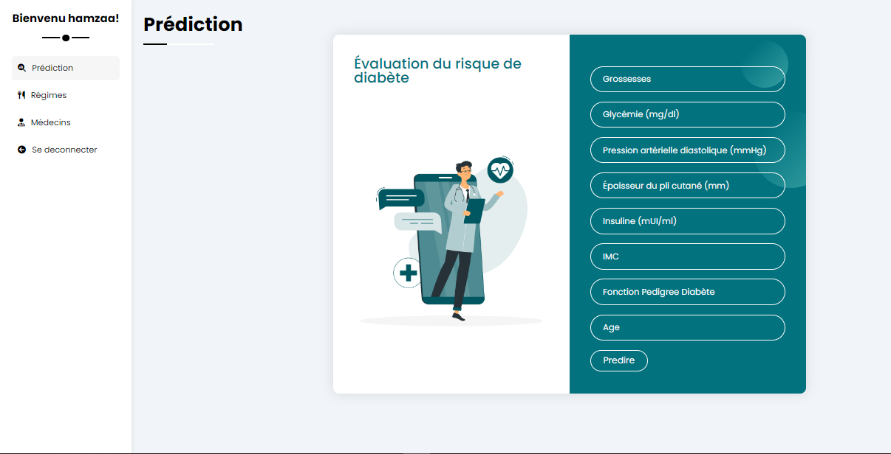
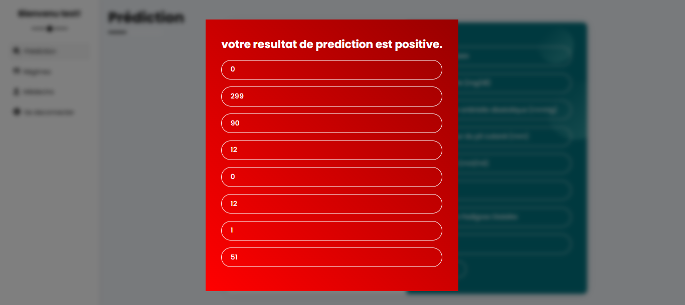
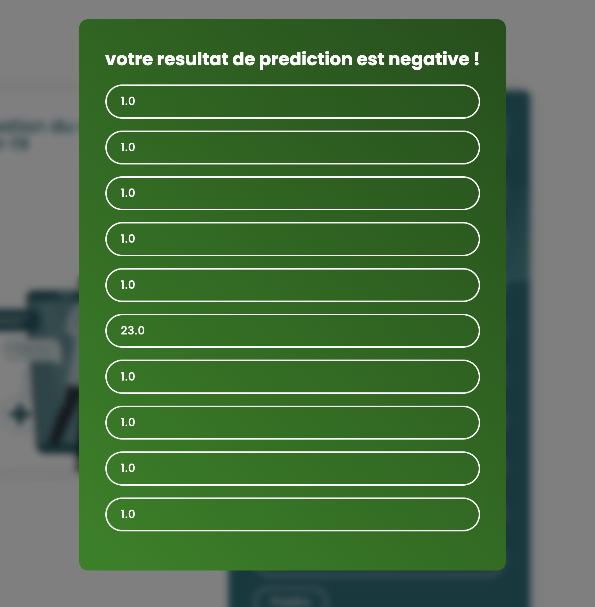
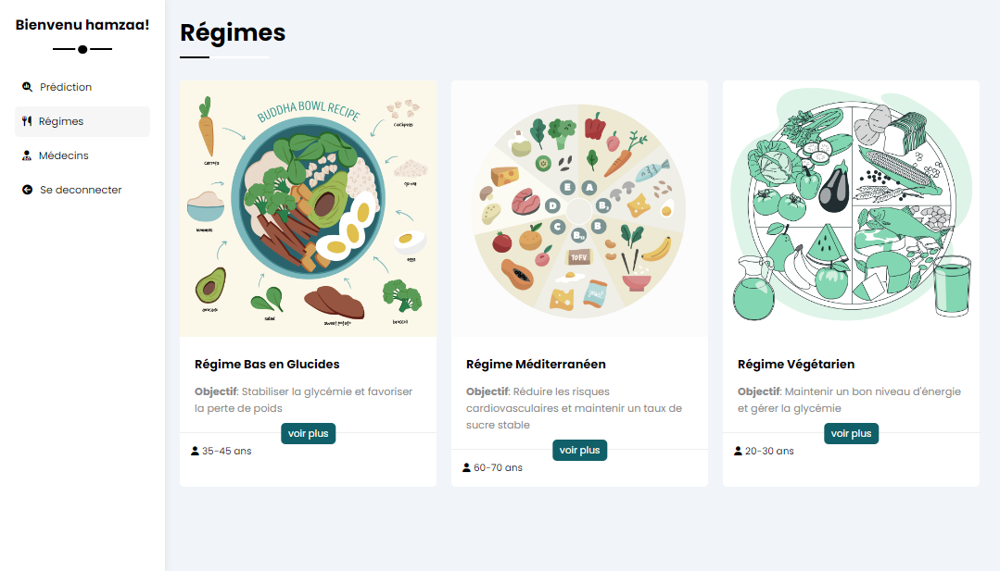
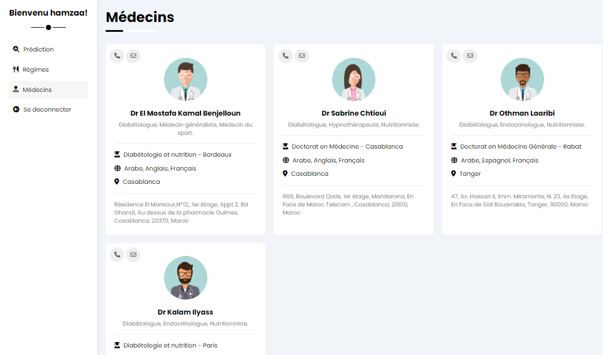

# Predilab - Diabetes Prediction and Information Platform

Predilab is an interactive web application designed to help users assess their risk of developing Type 2 diabetes with an accuracy of 89.5% . It includes features such as prediction based on clinical data, personalized recommendations, and informative articles.

## Features

- **Diabetes Prediction:** Enter your clinical data and get an estimate based on a machine learning algorithm.
- **Personalized Advice:** A dedicated section for diet plans tailored to diabetic individuals.
- **Specialist Contact:** An option to connect users with diabetologists.
- **Educational Articles:** Access informative articles on diabetes management and prevention.

## Screenshots

### Homepage


### Prediction Page


### Positive Result Example


### Negative Result Example


### Diet Plans


### Doctors Section


### Login Page


### Sign-Up Page


## Technologies Used

- **Frontend:** HTML, CSS, JavaScript.  
- **Backend:** Django.  
- **Database:** SQLite for secure user data storage.  
- **Machine Learning Model:** Random Forest Classifier for optimized results.  
- **Authentication:** Secure user management with email verification.

## Installation

1. Clone this repository:
   ```bash
   git clone https://github.com/SakkoumHamza/Diabetes-prediction-app.git
