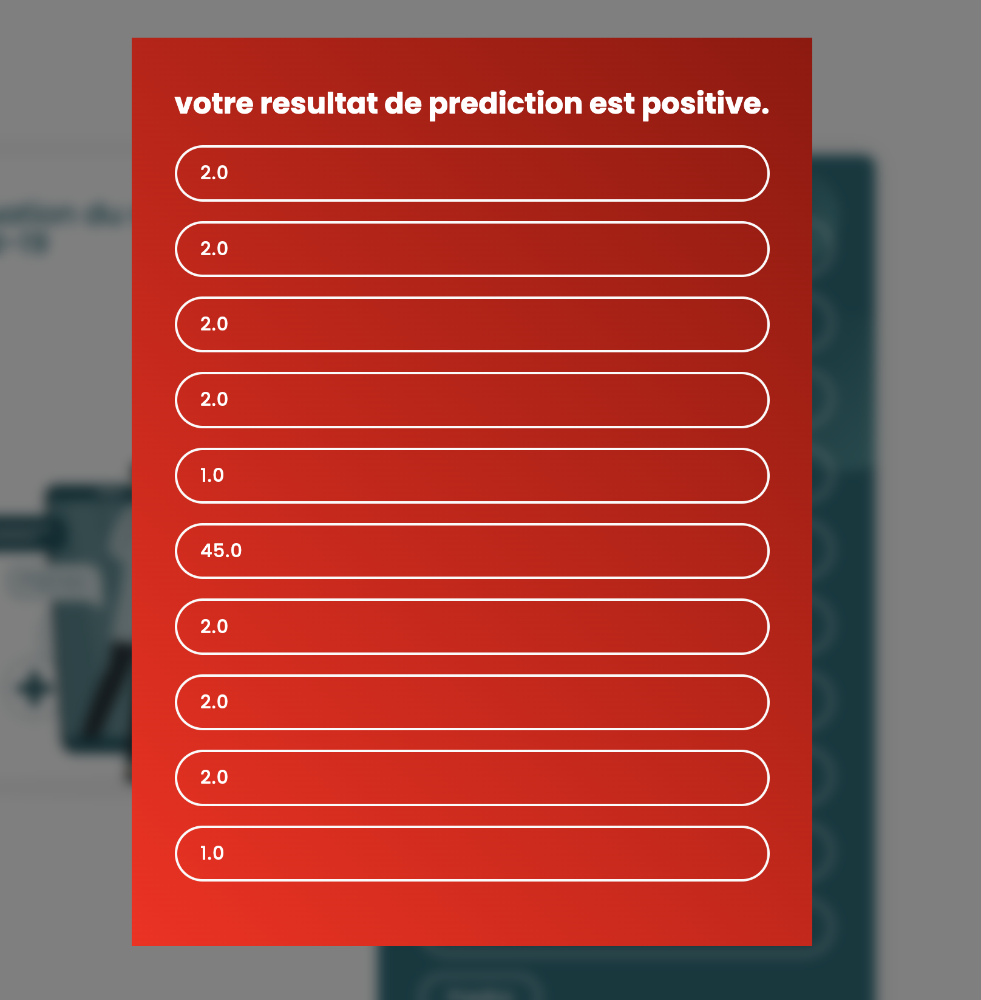

# COVID‑19 Cassandra App 🧬

A Django‑based web app using a pre-trained ML model to predict COVID-19 risk based on uploaded data, with a Cassandra backend for storage.

## 🖼️ Aperçu de l'application

web form:

<p align="center">
  
</p>

Negative covid19 prediction :

<p align="center">
  
</p>

Postive prediciton :

<p align="center">
  
</p>


## 🔍 Features

- **Web interface**: Upload medical data to get COVID-19 risk predictions.
- **ML model**: Uses a serialized (`covid_model.pkl`) model for inference generated via mode_generate.py.
- **Cassandra**: Stores input & prediction results in a Cassandra database with the prediction date.
- **Containerized**: `docker-compose.yml` orchestrates Cassandra container.

## 📦 Repo Structure
```bash
/
├── covid/ Django app code
│ ├── views.py Request handling & Cassandra write logic
│ ├── settings.py Settings including Cassandra config
│ ├── wsgi.py WSGI entrypoint
│ └── ...
├── data/
│ └── covid_data.csv Sample dataset (ignored via .gitignore)
├── static/ Static assets
├── templates/
│ └── predict.html Upload form & result page
├── covid_model.pkl Serialized ML model (ignored via .gitignore)
├── manage.py Django CLI
├── model_generate.py Trains and serializes the ML model
├── pipeline.py Data pre-processing pipeline
├── docker-compose.yml App + Cassandra orchestration
├── requirements.txt Python dependencies
├── README.md Project overview (you’re here!)
└── tests/ (optional) Unit & integration tests
```

## 🚀 Setup

### Prerequisites

- Python 3.12.2, Docker
- Django 5.2, scikit-learn 1.5.1 , numpy 1.26.4, pandas 2.2.2, joblib 1.4.2, cassandra-driver 3.29.2
- Covid 19 dataset from here : 'https://www.kaggle.com/datasets/meirnizri/covid19-dataset'

### Quick start (recommended)

```bash
git clone https://github.com/SakkoumHamza/covi19-cassandra.git
cd covi19-cassandra
docker-compose up
python3 manage.py runserver
